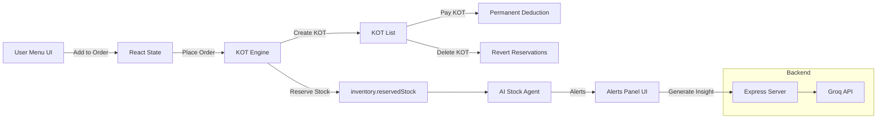
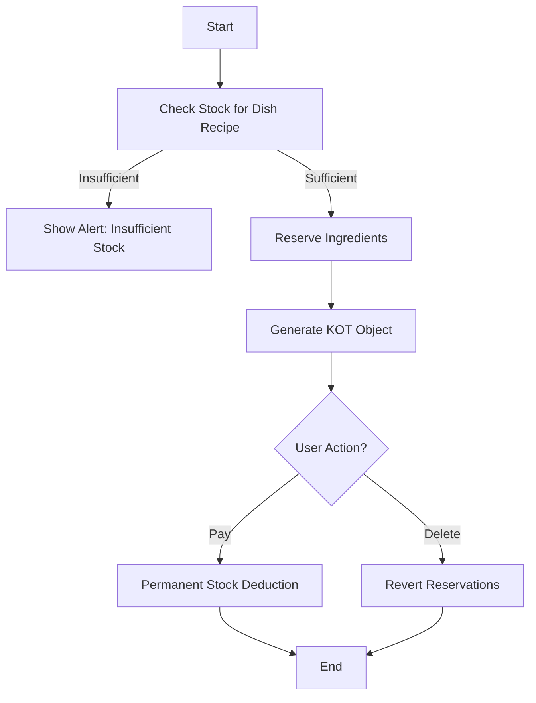

# 🎯 **PrimeOps — AI-Powered Kitchen Order Ticket (KOT) & Inventory Engine**

### *A production-grade restaurant management engine with real-time AI alerts, built using React, Node.js, and Groq LLM.*

---

<p align="center">
  
  
  
  
  
  
  
  
  
  
  
  
</p>

---

## 🚀 **Overview**

**PrimeOps** is a full-stack restaurant operations engine designed to handle:

✔ Fast menu ordering
✔ Real-time KOT generation
✔ Accurate ingredient tracking
✔ AI-powered stock monitoring
✔ Scalable kitchen operations

With a modern UI and production-grade logic, SmartKOT mirrors the workflow of real restaurants, making it ideal for:

* **Interviews**
* **Portfolio projects**
* **Restaurant POS simulations**
* **Inventory automation demos**

---

## 🎨 **UI/UX Design**

**PrimeOps** features a modern, production-ready interface with:

### ✨ **Design System**
* **Glassmorphism Effects**: Backdrop blur and transparency for depth
* **Gradient Accents**: Indigo to purple gradients for branding
* **Inter Font**: Professional typography with font-feature-settings
* **Smooth Animations**: Hover effects, transitions, and micro-interactions

### 📱 **Responsive Layout**
* **Mobile-First**: Optimized for all screen sizes
* **Adaptive Navigation**: Tab-based on mobile, sidebar on desktop
* **Touch-Friendly**: Large buttons and intuitive controls

### 🎯 **User Experience**
* **Visual Feedback**: Loading states, success animations, error handling
* **Accessibility**: Proper contrast, focus states, semantic HTML
* **Performance**: Optimized Tailwind with purging for small bundle size

---

## 🧩 **Key Modules**

### 🍽️ **1. Menu & Ordering System**

* Add to order
* Auto-check ingredient availability
* Prevent overbooking & stock misuse
* Quantity controls + live limits

### 👨‍🍳 **2. Kitchen Display System (KDS)**

* Real-time active KOT list
* Pay KOT → Permanently deducts stock
* Delete KOT → Reverts reserved stock

### 📦 **3. Inventory Engine + AI Alerts**

* Temporary vs permanent stock logic
* Expiry tracking (<= 3 days)
* Dynamic low-stock alerts
* Groq LLM–powered smart insights

---

# 🧠 **Why PrimeOps Is Special**

PrimeOps implements **real-world inventory behavior**, not dummy logic.

### ✔ Temporary Stock Reservation

When a KOT is placed, ingredients move to:

```
reservedStock (blocked but not consumed)
```

### ✔ Permanent Stock Deduction

After payment:

```
totalStock -= used
reservedStock -= used
```

### ✔ Reversal on Cancellation

```
reservedStock -= used
```

### ✔ Zero Race-Conditions

Using atomic updates + mutex lock to prevent duplicate KOT creation.

### ✔ AI Agent

Uses Groq Llama-3.3-70B with custom prompt to generate:

* bottleneck analysis
* dishes recommendation
* expiry insights

---

# 🏗️ **System Architecture**



---

# 🔁 **Inventory Engine UML Flow**



---

# ✨ **Features at a Glance**

| Feature                   | Description                        |
| ------------------------- | ---------------------------------- |
| **Real-time KOT**         | Instant ticket generation          |
| **Atomic Stock Engine**   | Prevents overbooking               |
| **Temporary Reservation** | Industry-grade inventory handling  |
| **AI Stock Alerts**       | Low-stock & expiry warnings        |
| **Groq AI Insights**      | Smart analysis of inventory        |
| **Responsive UI**         | Works on tab/phone/kitchen screens |
| **Dashboard View**        | Menu / Kitchen / Inventory tabs    |

---

# 🖼️ **Screenshots**

> 
---

# 🛠️ **Tech Stack**

| Layer            | Technology                                         |
| ---------------- | -------------------------------------------------- |
| Frontend         | React, TypeScript, Vite, TailwindCSS, Lucide Icons |
| Backend          | Node.js, Express                                   |
| AI               | Groq API – Llama-3.3-70B                           |
| State Management | React Hooks                                        |
| UI/UX            | Responsive, 3-column layout                        |
| Alerts           | Real-time AI + rule-based                          |

---

# 📡 **Backend API Structure**

### `POST /ai/inventory`

*Request*

```json
{
  "prompt": "Analyze inventory"
}
```

*Response*

```json
{
  "text": "Your stock analysis here…"
}
```

---

# ⚙️ **Installation & Setup**

### **1. Clone Repository**

```bash
git clone https://github.com/yourusername/smartkot.git
cd smartkot
```

### **2. Install Frontend**

```bash
npm install
npm run dev
```

### **3. Install Backend**

```bash
cd server
npm install
node server.js
```

---

# 🔐 **Environment Variables**

Create a file: `.env`

```
GROQ_API_KEY=your_api_key_here
```

---

# 📁 **Folder Structure**

```
smartkot/
│── src/
│   ├── components/
│   ├── services/
│   ├── constants/
│   ├── types.ts
│   ├── App.tsx
│── server/
│   ├── server.js
│── public/
│── README.md
│── package.json
```

---

# 🤝 **Contributing**

Contributions are welcome!

1. Fork the repo
2. Create a branch
3. Commit changes
4. Open a PR

---

# 🚀 **Future Enhancements**

* Multi-branch restaurant support
* Printer support for KOT thermal printing
* Dashboard analytics (daily sales, wastage report)
* User authentication (admin, cashier, kitchen staff)
* Billing module
* Supplier management

---

# 📄 **License**

MIT License © 2025 Nithin Banothu

